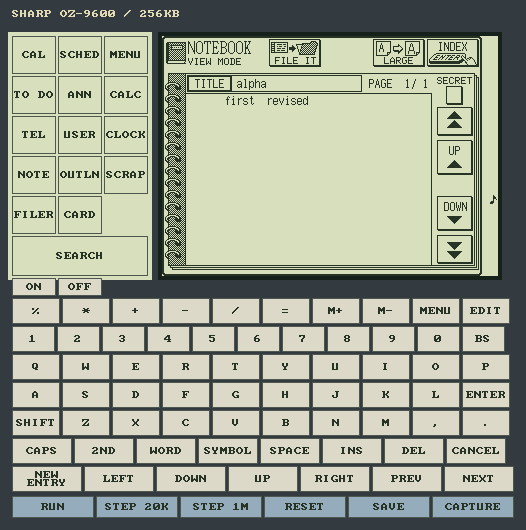
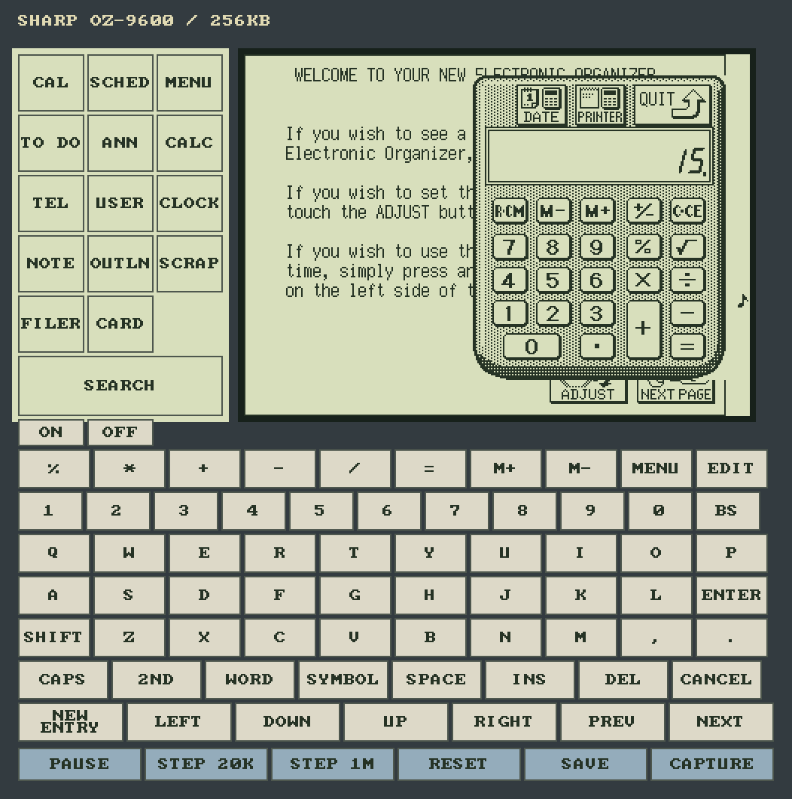
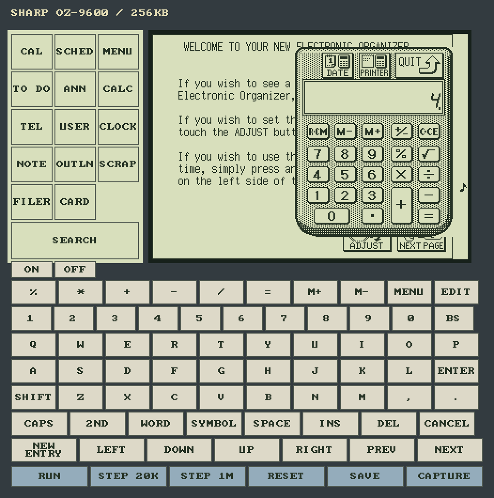
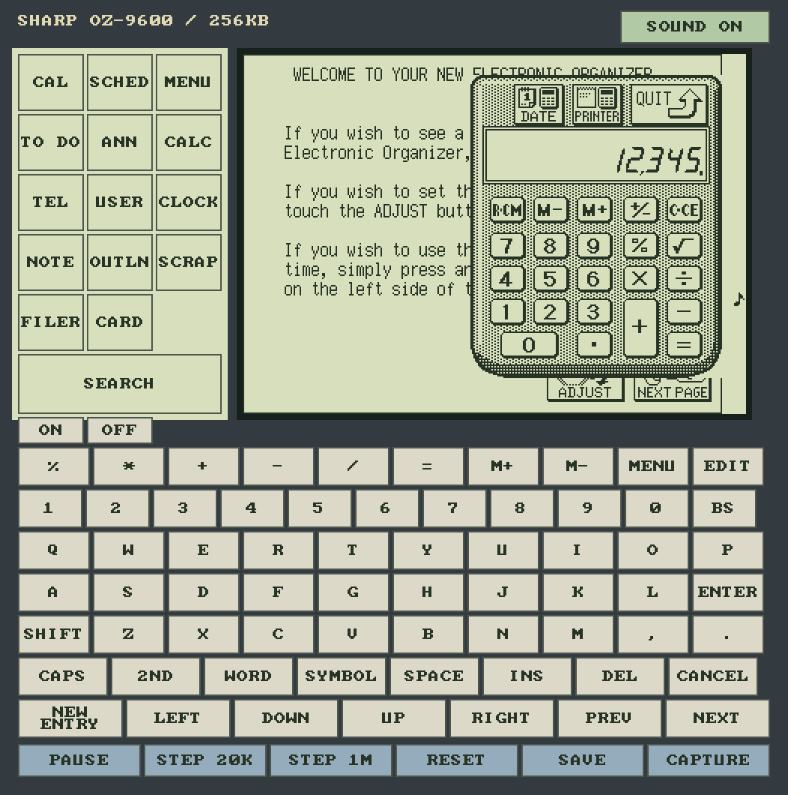

# OZ-9600 native bitmap window

This host frontend uses `CoreRuntime::for_model(DeviceModel::Oz9600, bundle)`.
The LCD is the complete 336 × 240 controller observation. Fixed left-panel
artwork and physical keycaps sit outside it. The bezel is an approximation of
the user's unit; the physical LCD crop and annunciator wiring remain unresolved.

From the public repository root:

```sh
cargo build --release --manifest-path sc62015/native-window/Cargo.toml
sc62015/native-window/target/release/oz9600-window \
  --rom /path/to/verified.ozrom \
  --profile provisional-v1 \
  --retained-out /tmp/oz-retained.bin \
  --capture-prefix /tmp/oz-screen
```

The native build requires Rust 1.89 or newer for
[standard-library advisory file locking](https://doc.rust-lang.org/std/fs/struct.File.html#method.try_lock).

For automatic recovery and saving, add `--state /path/to/my-oz9600.ozbat`.
It loads that file if present, then atomically saves RAM/RTC every five seconds,
on Pause/Reset/Save and at exit. Start the same command again to recover records.
A missing file starts empty; an invalid or unreadable existing file rejects
startup without replacing it. Save failures appear in the window title and
retry; use Save or quit for a final flush. The parent directory must exist.

A sidecar `.lock` prevents another cooperating native process from using the
same state path; the OS releases its advisory lock on exit or crash. The empty
sidecar may remain. Atomic replacement keeps the previous complete image if a
write fails, and Unix directory sync covers the rename. Sudden termination can
lose changes since the last successful save. Card SRAM still uses the separate
explicit card output. The state file is a full CPU/peripheral session, including the current editor
and controller pixels. Legacy RAM/RTC state files remain readable and upgrade
to full sessions on the next successful save. Full sessions require the same
verified ROM bundle and compatible execution profile. Card sessions and
external serial-device connections are not included.

`--retained` is an explicit import and cannot be combined with `--state`.
`--retained-out` remains an explicit backup/export; it now uses atomic writes.
Add `--retained /path/to/saved.ozbat` to recover saved records with a fresh CPU,
or `--retained /path/to/saved.ozsession` to resume a full session exported by
the browser. For empty memory,
touch initialization YES, wait for Welcome, and use ADJUST to set the clock.
Startup errors stay visible in a host recovery window. F5 retries the same
files and profile; F8 copies the original saved bytes to a distinct
`.recovery-*` file beside the source, including an invalid image. Restore a
known-good backup at the displayed state path and press F5 to retry. Page
Up/Down scroll long details; Escape closes with a failure exit status. No fresh
image or periodic save runs in this window. Headless failures still return
immediately for scripts.

The host Run/Resume control starts execution. Allow the ROM to finish drawing
its startup screen before choosing an application. ON is a guest ON/QUIT
contact, not the host Run control; its warm-start routing remains provisional.

The default profile is **strict**; `provisional-v1` must be selected explicitly.
It selects initial CPU BP=D0 for all-zero SRAM and BP=00 for populated saved
SRAM before execution, without guest-memory repairs or injected callbacks.
It retains the shared
core's provisional arithmetic, interrupt and clock assumptions. UI integration
does not qualify hardware reset, timing, SRAM aliases, serial or card mapping.

Keyboard letters/digits, arrows, Space, Enter, Backspace, Delete and modifiers
drive physical matrix contacts through the shared key table. Escape is Cancel;
Alt is 2nd; Page Up/Down are Prev/Next. F1 is New Entry, F2 Edit, F3 Menu and
F6 Symbol. Numpad operators map to their physical calculator contacts. Pointer
presses on the printed panel and LCD drive raw tablet samples using the ROM's
default calibration. Those samples have not been measured on a physical unit.

Clock is a momentary popup. Hold the printed Clock target to keep the ROM
view visible; release closes it after input processing. Exact physical release
timing is unqualified.

ON and OFF keycaps appear below the fixed panel. F12 holds the separate CPU
ON contact; Pause holds the matrix OFF contact. The ON key uses the same shared
API as physical replays and the browser. It does not expose a guessed RTC B0
cause or qualify the RTC's electrical ON-output route. Manual ON resumes CPU
execution under the experimental RTC profile; previous-application restoration,
automatic alarm wake and alarm dismissal remain unresolved.

A stored Notebook record recovered through genuine ROM execution after restart
(full controller bitmap in the host renderer):



F9 runs/pauses, F10 steps 20,000 boundaries, F11 steps 1,000,000, F5 starts
a fresh CPU while preserving RAM/RTC, F7 captures, and F8 saves. Reset discards
unfinished editor context; full-session restore or close/reopen resumes it. Host
controls are also visible below the keyboard. Faults stop execution until reset.

`--execution-mode interactive` uses nominal shared pacing; `turbo` runs bounded
slices without throttling; `deterministic` requires explicit step budgets.
`--paused` starts paused. By default, very short contacts remain held until
40,000 scheduler boundaries have elapsed; `--minimum-contact-boundaries 0`
selects immediate release. Input does not advance a paused guest: use Run or
Step to process it. Focus loss cancels all contacts immediately.
Ordered OS key/mouse events preserve short taps and modifier ownership.
A fresh pointer press works after keyboard focus returns. A press held across
focus loss or started in the background remains cancelled until release.
Guest faults reject contacts, including keys held during later synchronization;
visible host Save, Capture and Reset controls remain available. The window title
keeps the faulted state visible while acknowledging Save and Capture. Run/step
controls continue to require a healthy guest.



The headless handler probe matches an independent normal-input runner. A
separate live macOS session entered 1 through a keycap, 2 through the LCD, then
+3= through pointer and keyboard input. All 25 replay observations agree between
the window and ordinary CLI; the final live CPU/peripheral fields, complete LCD
and saved RAM/RTC agree with both.


A registered macOS app also records actual focus loss with all contacts released,
keyboard focus restoration, and the first fresh pointer press entering 4. Its
nine observation replay matches both runners and the complete final live state.



These images are enlarged native capture output from the live sessions; they
omit macOS window decorations. A genuine strict-startup fault separately checks
pointer and keyboard Save/Capture feedback, blocked guest contacts and Reset
with exact retained-byte preservation and a matching fresh factory. Strict
cold initialization and physical reset, calibration and timing remain open.

The **Sound off/on** button above the LCD enables playback of the shared core's
48 kHz digital PCM through the default audio output device. `--sound` enables it
at launch. Sound is muted by default and plays during foreground interactive
execution. Pause, stepping, focus loss, reset and mute clear queued audio;
replay, headless and turbo execution stay silent. Mute leaves guest execution
running. Device errors report “Sound unavailable” and leave the emulator usable.

Playback keeps the newest 100 ms of source samples, converts to the device's
rate and applies a 40 Hz host DC blocker. It supports float32, signed16 and
unsigned16 output, with silence on underrun. These are host playback choices;
physical buzzer pitch, volume and clock accuracy remain unqualified. The Python
queue reference is `pce500/oz9600/native_audio.py`.

Audio uses [CPAL](https://docs.rs/cpal/0.18.2/cpal/). Linux builds need the ALSA
development package (for example, `sudo apt-get install libasound2-dev`). Add
`--no-default-features` to the Cargo command to build without an audio backend;
the Sound control then reports its unavailability without stopping execution.



The pictured session used ordinary keyboard contacts. Its accepted input trace
reproduced the final full guest state, controller bitmap and retained RAM/RTC
exactly; the host device consumed nonzero PCM frames.

`--replay` applies validated physical inputs before opening the window.
`--headless --replay PATH` uses the same factory without an OS window.
`--replay-report` exports the ordinary CPU/peripheral observations. Captures
include unscaled `.pbm`, host `-window.ppm` and read-only `-state.json`.
`--event-log` records accepted live contacts and exact boundary budgets at
close; concatenate it after the startup replay to reproduce the session.
Reset is disabled during recording because each trace has one reset epoch.
`--host-status PATH` enables read-only host-input diagnostics.

The frontend uses [winit's ordered window events](https://docs.rs/winit/0.30.13/winit/event/enum.WindowEvent.html)
and [softbuffer's window surface](https://docs.rs/softbuffer/0.4.8/softbuffer/struct.Surface.html).
Cursor and surface dimensions use physical pixels, so rendering and tablet
conversion share the same scaling on a Retina display. Python layout/contact
references live in `pce500/oz9600/ui.py`.

On macOS, create a local app bundle after building:

```sh
uv run python sc62015/native-window/package_macos.py
open -n 'sc62015/native-window/target/release/OZ-9600 Emulator.app' --args \
  --rom /absolute/path/to/verified.ozrom \
  --profile provisional-v1 --retained-out /tmp/oz-retained.bin
```

The app requires access to the window server. Builds, ROMs and captures remain
local. macOS was exercised directly; other desktop platforms are not yet
qualified by a live-window run.

An optional OZ-707 BASIC card uses separate ROM and SRAM files:

```sh
sc62015/native-window/target/release/oz9600-window \
  --rom /path/to/verified.ozrom \
  --profile experimental-isr-mti-writable \
  --retained /path/to/rom-generated-retained.bin \
  --card-rom /path/to/verified-oz707.bin \
  --card-sram /path/to/oz707-sram.bin \
  --card-sram-out /tmp/oz707-sram.bin
```

Both card inputs are required together. The shared factory checks the exact
128 KiB ROM identity and 32 KiB SRAM size before execution. Card selects the
application through normal ROM input; the guest draws and handles its keypad.
The host sends raw tablet coordinates rather than translating keypad cells.
F5 preserves both current main memory and card SRAM; F8 saves either configured
output. Card SRAM remains separate from the main retained-state format.

This logical slot uses an explicit provisional SSR bit-1 presence signal,
repeated ROM views and an upper writable SRAM view with a lower read-only
mirror. Normal-input replay checks SIN, inverse SIN, RUN/PRO, storing
`10 PRINT 2+3`, running it and recovering it after reset. Physical slot
wiring, mapper aliases and the remaining card functions are unqualified.
